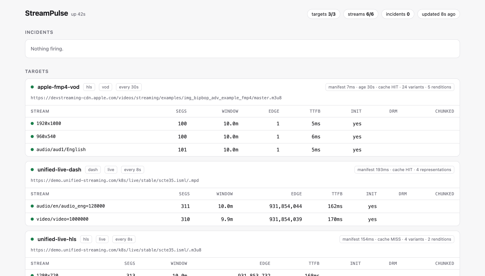
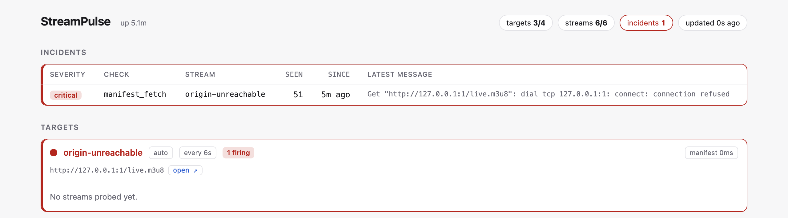
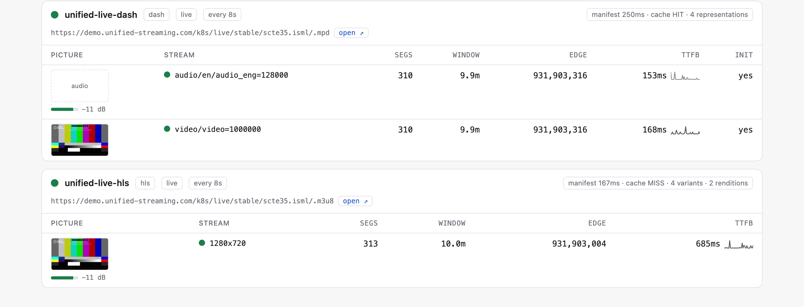
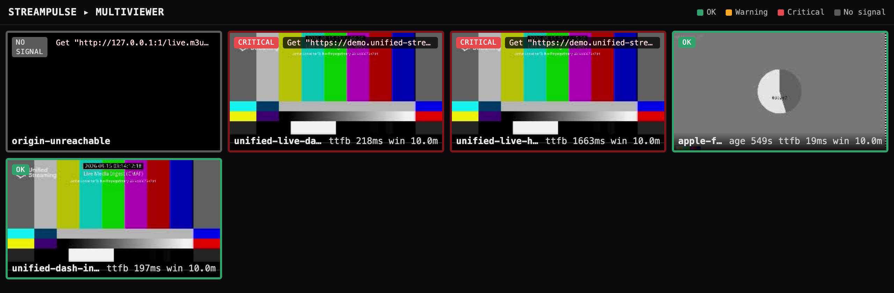

# StreamPulse

[](https://github.com/sthavana/streampulse/actions/workflows/ci.yml)
[](https://go.dev)
[](LICENSE)

**Synthetic health monitoring for HLS and DASH.** It pulls your manifests and
segments the way a player would, and tells you what is broken before viewers do
— and *which layer* broke.

68 checks · origin-vs-CDN fault attribution · Prometheus and Grafana · a
multiviewer wall · Go standard library only · two static binaries



New here? [**How a stream gets to a viewer, and where it breaks**](docs/STREAMING.md)
is the background these checks assume, and
[**what running it for a day found**](#what-running-it-for-a-day-found) is the
most honest thing in this repository.

## The problem

Streaming monitoring is mostly passive: ingest logs, wait for a QoE dashboard to
dip, then spend an hour working out whether it was the encoder, the packager or
the CDN. By then people have already switched off.

StreamPulse probes actively instead, on a tight schedule, from wherever you run
it. It parses what it gets back the way a player would and reports faults as
they appear — 68 checks across both formats, deduplicated into incidents
so one frozen playlist is one alert rather than 900.

And where it can, it says which layer to look at:



Every one of those is the same fault a player would hit, seen from outside. The
bracketed part is the interesting bit: a manifest 300s old out of a CDN cache
accounts for a 300s lag on its own, so the packager was only 3.9s behind when it
wrote it. That is the difference between waking the CDN team and waking the
encoding team.

## Quickstart

Requires Go 1.22+. No dependencies to install.

**Just the prober**, against your own streams:

```bash
cp config.example.json config.json   # point it at your streams
make run
```

That gives you the UI on http://localhost:9090, metrics on `/metrics`, and
findings as JSON lines on stdout. Nothing else is running — Prometheus and
Grafana are the next option.

**The whole stack** — prober, Prometheus and Grafana together, against public
test streams:

```bash
make compose-up      # make compose-down to stop it
```

| | |
|---|---|
| StreamPulse UI | http://localhost:9090 |
| Prometheus | http://localhost:9091 |
| Grafana | http://localhost:3000 (anonymous, no login) |
| findings | `docker compose -f deploy/docker-compose.yml logs -f prober` |

The compose stack builds the small `scratch` image, so it has no ffprobe and
therefore no [media inspection or thumbnails](#looking-inside-the-media-optional).
For those, and for the [multiviewer](#multiviewer):

```bash
make compose-up-full     # the same stack, plus pictures and the tile wall
```

| | |
|---|---|
| Multiviewer | http://localhost:9092/mosaic |

Everything else stays where it was. The wall is on 9092 here because
Prometheus has 9091 in this stack; standalone it defaults to 9091.

**Two of the five demo targets are broken on purpose**, because a monitoring
tool showing nothing but green tells you nothing about itself:

- `origin-unreachable` points at a dead port. No manifest, no pictures: a grey
  **no signal** tile and a critical incident.
- `apple-declared-live` is Apple's VOD clip declared as live, so
  `unexpected_endlist` fires while the video keeps decoding perfectly. It is
  the more interesting of the two — a flawless picture inside a red border,
  which is exactly the fault a wall of pictures alone would never show you.

Delete them from `deploy/config.json` for an all-green stack; the prober
re-reads it while running, so the tiles and their incidents disappear within a
few seconds without a restart.

Both run off the same `deploy/config.json`, which asks for ffprobe either way.
On the small image it is simply absent, the prober says so at startup and
carries on:

```
media inspection disabled: ffprobe not found on $PATH
frame capture disabled: ffmpeg not found on $PATH
```

Three targets up, six streams, every other check running, no pictures. That is
the optional dependency working as intended, and running both stacks off one
config is the cheapest way to see it.

Stop either with `make compose-down`.

Working on it:

```bash
make check         # gofmt, go vet, and the tests under -race
make check-linux   # the same suite on Linux, where CI runs it
```

Prebuilt binaries for linux and darwin, amd64 and arm64, are attached to every
[release](https://github.com/sthavana/streampulse/releases) with a
`SHA256SUMS` alongside. Both binaries take `-version`, and the prober reports
the same string in `/api/state` — a build that cannot say what it is asks its
operator to take the findings on trust.

`check-linux` exists because the difference has bitten twice: CI runs on
Linux, where `/bin/sh` is dash and a killed process's children keep its pipes
open, and both times a macOS run reported everything green.

## What it catches

| | |
|---|---|
| **Availability** | manifests and segments that 404, time out, or return something that is not a manifest |
| **Liveness** | frozen live edges, timelines going backwards, less DVR than the manifest promises, edges drifting behind wall clock |
| **Structure** | spec violations, dangling rendition groups and DASH dependencies, missing initialisation sections, empty playlists and adaptation sets, holes and overlaps in a DASH timeline or at a period boundary |
| **DRM** | unretrievable keys, clear segments on an encrypted stream, malformed PSSH, keys that stopped rotating |
| **Low latency** | both formats: LL-HLS parts, hold-back and blocking reload actually being honoured; LL-DASH chunked delivery silently degraded to whole-segment buffering |
| **The media itself** | codec and resolution that disagree with the manifest, declared tracks that are not there, black or frozen video, silent audio; a picture and level per stream *(optional, needs ffprobe/ffmpeg)* |
| **Transport streams** | TR 101 290 P1: sync loss, transport errors, continuity breaks, missing PAT/PMT *(no dependency)* |
| **Which layer** | origin versus CDN edge, from the cache headers on the response |
| **Which region** | run it in several places; the vantage labels every metric and every incident |

Each is a named check with a severity; the tables further down list every one.

## Design in one paragraph

Standard library only — the HLS and DASH parsers, the Prometheus exposition, the
web UI and the notifiers are all written here and all small. The single
exception is media inspection, which shells out to ffprobe and is optional, off
by default, and in its own image, because writing a demuxer would be
reinventing something ffmpeg has spent twenty years getting right. Findings are
deduplicated into incidents before anyone is told. Checks that cannot be
answered honestly abstain rather than guess, and the sections below say where
and why.

## Positioning

**Self-hostable** — no shipping stream data to a SaaS. **Dependency-light** —
one static binary, and the only optional dependency is namable in a sentence.
**Metrics-first** — it drops into an existing Prometheus, Grafana and
Alertmanager stack rather than asking you to adopt another dashboard, and the
web UI above answers the question those cannot: what is happening *right now*.

## Contents

**Checks**
[HLS](#what-it-checks-today-hls) ·
[renditions](#renditions-ext-x-media) ·
[init sections](#initialisation-sections-ext-x-map) ·
[DRM](#drm-and-ext-x-key) ·
[DASH](#dash) ·
[which layer broke](#which-layer-broke-cache-attribution) ·
[multi-vantage](#multi-vantage) ·
[reload without restart](#adding-a-stream-without-a-restart) ·
[transport streams](#transport-stream-integrity) ·
[media inspection](#looking-inside-the-media-optional)

**Operating it**
[alerting](#alerting-incidents-not-findings) ·
[maintenance windows](#maintenance-windows) ·
[web UI](#web-ui) ·
[multiviewer](#multiviewer) ·
[metrics](#metrics-exposed-metrics) ·
[deployment](#deployment) ·
[production guide](docs/DEPLOYMENT.md)

**Background**
[how a stream gets to a viewer, and where it breaks](docs/STREAMING.md) ·
[decisions, and the four that were wrong first](docs/DECISIONS.md) ·
[HTTP API](docs/API.md) · [security](SECURITY.md)

**About**
[architecture](#architecture) ·
[design choices](#deliberate-design-choices) ·
[what a day of running found](#what-running-it-for-a-day-found) ·
[roadmap](#roadmap) ·
[status](#status)

---

## What it checks today (HLS)

Variants and `EXT-X-MEDIA` renditions alike -- the playlist checks below run
against alternative audio and subtitle tracks as well as the video ladder.

If the vocabulary in these tables is unfamiliar, [**how a stream gets to a
viewer, and where it breaks**](docs/STREAMING.md) is the background: ABR
ladders, packaging, HLS and DASH in detail, low latency, and what origins and
CDNs each contribute to a fault. Every section ends with the checks that catch
what it describes.


| Check | Severity | What it catches |
|---|---|---|
| `manifest_fetch` / `media_fetch` | critical | Origin/CDN unreachable or non-200 |
| `segment_availability` | critical | Manifest references a segment that 404s / errors |
| `playlist_stalled` | critical | Live media sequence not advancing (frozen edge) |
| `playlist_rollback` | critical | Media sequence went backwards (stale origin / failover) |
| `no_segments` | critical | Playlist parsed but empty |
| `unexpected_endlist` | critical | `EXT-X-ENDLIST` on a stream you declared live |
| `targetduration_violation` | warning | Segment longer than `EXT-X-TARGETDURATION` (RFC 8216) |
| `pdt_not_advancing` | warning | Window slid but `PROGRAM-DATE-TIME` did not follow |
| `pdt_stale` | warning | Projected live edge is behind wall-clock |
| `short_window` | warning | Live/DVR window shorter than expected |
| `targetduration_missing` | warning | Missing required tag |
| `init_segment_availability` | critical | `EXT-X-MAP` initialisation section 404s -- playback cannot start at all |
| `map_missing_uri` | critical | `EXT-X-MAP` with no `URI`, which the spec requires |
| `rendition_group_missing` | critical | Variant references an AUDIO/SUBTITLES/VIDEO group no `EXT-X-MEDIA` declares |
| `rendition_duplicate_name` | warning | Two renditions in one group share a `NAME` (RFC 8216 4.3.4.1.1) |
| `rendition_multiple_default` | warning | More than one `DEFAULT=YES` in a group |
| `closed_captions_with_uri` | warning | `CLOSED-CAPTIONS` rendition carries a `URI`, which the spec forbids |
| `unexpected_clear_segments` | critical | Segments with no `EXT-X-KEY` on a stream declared encrypted |
| `key_fetch` | critical | Key URI unreachable or non-200 |
| `key_size_invalid` | critical | Identity key URI returned something other than 16 bytes |
| `key_missing_uri` | critical | `EXT-X-KEY` with a method but no `URI` |
| `key_invalid_iv` | warning | `IV` is not `0x` + 32 hex digits |
| `key_rotation_stalled` | warning | Key unchanged for longer than the expected rotation interval |
| `pssh_malformed` / `pssh_empty` | warning | Embedded PSSH box fails to parse or carries nothing |
| `part_target_violation` | warning | An `EXT-X-PART` longer than the declared `PART-TARGET` |
| `part_target_missing` | warning | Parts published with no `EXT-X-PART-INF` |
| `part_hold_back_too_small` | warning | `PART-HOLD-BACK` below the three part durations the spec requires |
| `part_hold_back_missing` | warning | Parts published with nothing telling players how close to the edge is safe |
| `blocking_reload_undeclared` | warning | Parts published without `CAN-BLOCK-RELOAD=YES`, so players must poll |
| `blocking_reload_missing` | warning | The origin declares blocking reload and answers immediately anyway |
| `no_independent_part` | info | No published part starts on an IDR, so a joining player waits for the next segment |
| `discontinuity_present` | info | Discontinuity markers in window (ad-break awareness) |
| `codec_mismatch` | warning | The media carries a different codec from the one declared |
| `resolution_mismatch` | warning | The media is a different resolution from the one declared |
| `audio_track_missing` / `video_track_missing` | warning | A declared track is absent from the media |
| `media_unreadable` | critical | The bytes arrived and ffprobe cannot read them |

Each finding is also counted in `streampulse_findings_total{check,severity,...}`.

## Renditions (EXT-X-MEDIA)

Alternative audio, subtitle and video-angle tracks are declared with
`EXT-X-MEDIA`, separately from the `EXT-X-STREAM-INF` ladder. A tool that walks
only the variants will report a stream as perfectly healthy while its audio is
dead -- which is one of the more common real-world breaks.

Renditions carrying a `URI` are probed with the same rules as any media
playlist: reachability, stall and rollback, PDT progression, segment
availability and TTFB. They are declared once at the master level, so they are
fetched once per cycle no matter how many variants reference them.

A rendition with **no** `URI` is skipped, and that absence is meaningful rather
than a defect: audio without a URI is muxed into the variant streams, and for
`CLOSED-CAPTIONS` the URI *must not* be present at all -- captions ride inside
the video segments. Unified Streaming's live demo declares its audio this way;
Apple's fMP4 example ships separate audio and subtitle playlists.

Renditions are labelled `type/group/name`, e.g. `audio/aud1/English`. The group
is part of the label because `NAME` alone is not unique: Apple's own reference
stream declares three audio renditions all named "English" (a stereo mix and
two 5.1 mixes) in groups `aud1`/`aud2`/`aud3`. Labelling them by name alone
would collapse three independent tracks into one metric series and one
incident, masking a break in any of them.

Two per-target knobs, both optional:

```json
"max_renditions": 0,              // 0 = all renditions that have a URI
"rendition_types": ["AUDIO"]      // omit for every type
```

`rendition_types` is the one to reach for on a stream carrying thirty subtitle
languages you do not need to probe every few seconds.

## Initialisation sections (EXT-X-MAP)

Every fMP4 stream carries an `EXT-X-MAP`: the initialisation section a player
loads before it can decode anything. Nothing else in the playlist references
it, so when it goes missing the manifest still parses, every media segment
still serves, and playback simply never starts. It gets a request of its own
for that reason, and unlike a segment at the live edge it is static, so a 404
there is unambiguous.

Each distinct section is fetched once per cycle however many segments
reference it. A playlist has more than one when the initialisation section
changes mid-stream, which happens at a discontinuity between differently
packaged sources. A `BYTERANGE` section is probed *at its declared offset*
rather than at byte zero, so a file truncated before the part that matters is
caught instead of passed.

`EXT-X-MAP` and a DASH `Initialization` are the same object under two names,
and both formats run the same check through the same code: a stream is not
judged differently for saying it in a different dialect. Exported as
`streampulse_init_segment_available`.

## DRM and EXT-X-KEY

Key problems are among the most expensive stream failures: playback stops dead
for every viewer at once, and the manifest and segments all look fine.
StreamPulse parses `EXT-X-KEY` and `EXT-X-SESSION-KEY`, tracks which key
applies to which segment, and optionally proves the key is actually retrievable.

```json
"expect_encrypted": true,
"fetch_keys": true,
"key_rotation_max_seconds": 3600
```

**`expect_encrypted`** catches clear-lead leakage: segments going out
unprotected on a stream that is supposed to be encrypted. Nothing 404s and the
stream plays perfectly, which is exactly why it goes unnoticed. `METHOD=NONE`
is parsed as what it is -- a deliberate return to clear -- so a mid-playlist
switch is detected rather than ignored.

**`fetch_keys`** retrieves each distinct key URI, as a player would. For an
`identity` KEYFORMAT (plain AES-128) the response must be exactly 16 bytes; a
key endpoint serving an HTML error page with HTTP 200 is a real failure mode
that a reachability check alone would pass.

> Key material is never written to a finding, a log line, or a notification.
> Findings carry the URI, the DRM system, and byte counts only.

Not every key URI is an HTTP resource, and those are skipped rather than
reported as failures: FairPlay uses `skd://`, and Widevine and PlayReady
usually embed initialisation data in a `data:` URI. Embedded payloads carrying
a `pssh` box are parsed and validated (system ID, KIDs, size fields); a payload
that is *not* a PSSH box is left alone, because PlayReady commonly ships a bare
PlayReady Object and flagging it would be a false positive.

Relative key URIs (`URI="key.bin"`) resolve against the media playlist, which
is how most packagers write them.

**`key_rotation_max_seconds`** flags a live stream whose keys have stopped
rotating. It is opt-in because plenty of streams legitimately never rotate.
It applies to DASH too, where the identity compared is what the manifest
asserts -- the `default_KID`s and the `cenc:pssh` -- rather than a key URI.
The elements are compared sorted, so a packager reshuffling its output is not
mistaken for a rotation.

## DASH

Point a target at an `.mpd` and it is probed: the manifest is fetched and
parsed, every representation is enumerated, and the most recent segments of
each are fetch-checked. Findings go through the same incidents, maintenance
windows and metrics as the HLS path.

| Check | Severity | What it catches |
|---|---|---|
| `manifest_fetch` | critical | Origin/CDN unreachable or non-200 |
| `manifest_parse` | critical | Response is not a parsable MPD (a CDN error page served with a 200) |
| `manifest_empty` | warning | MPD parsed but declares no representations |
| `no_segments` | critical | No segment is available in the current window |
| `segment_availability` | critical | A segment the MPD points at 404s / errors |
| `playlist_stalled` | critical | Timeline not advancing (frozen live edge) |
| `playlist_rollback` | critical | Timeline went backwards (stale origin / failover) |
| `short_window` | warning | Live/DVR window shorter than expected |
| `unexpected_static` | critical | `type="static"` on a stream you declared live |
| `edge_stale` | warning | Live edge falling behind wall-clock (encoder losing ground) |
| `init_segment_availability` | critical | Initialisation segment 404s -- playback cannot start at all |
| `unexpected_clear_segments` | critical | No `ContentProtection` on a stream declared encrypted |
| `pssh_malformed` / `pssh_empty` | warning | `cenc:pssh` fails to parse or carries nothing |
| `kid_invalid` | warning | `default_KID` is not a key id |
| `discontinuity_present` | info | More than one period (each boundary is a splice point) |
| `chunked_delivery_missing` | warning | A low-latency stream is being delivered as whole buffered segments |
| `utc_timing_missing` | warning | Low-latency stream declares no `UTCTiming` |
| `timeline_gap` | critical/warning | A hole in a `SegmentTimeline`: media time nobody can request |
| `timeline_overlap` | critical/warning | Two runs of segments claiming the same media time |
| `period_gap` | critical/warning | A hole at a period boundary -- where SSAI stitching goes wrong |
| `period_overlap` | critical/warning | A period starting before the previous one ends |
| `window_below_declared` | warning | Less DVR than `@timeShiftBufferDepth` promises |
| `segment_duration_violation` | warning | A segment longer than `@maxSegmentDuration` |
| `period_empty` | critical | A period declaring no adaptation sets -- nothing to play for its duration |
| `adaptation_set_empty` | critical | A track with no representations under it |
| `representation_duplicate_id` | critical | Two representations sharing an `@id`, so `$RepresentationID$` collides |
| `dependency_missing` | critical | `@dependencyId` pointing at a representation the period does not contain |
| `adaptation_set_multiple_main` | warning | Two sets of one type and language both claiming `Role=main` |
| `representation_missing_mime` | warning | No `@mimeType` on the representation or the set above it |
| `representation_missing_codecs` | warning | Audio or video declaring no `@codecs` |
| `key_rotation_stalled` | warning | Declared encryption unchanged for longer than expected *(opt-in)* |

### What the manifest promises, and whether it is true

The last six of those are a different kind of check from the rest. Everything
above them asks whether the CDN answered; these ask whether the document is
self-consistent -- and every number they compare against is one the packager
put in the manifest itself, so none of them needs configuring.

- **A timeline is a contract about media time.** Each `S` states a start `@t`,
  a duration `@d` and a repeat count `@r`, and the next run is expected to
  begin exactly where the last one ended. When it does not, the presentation
  has a hole in it or two segments claiming the same instant, and a player
  reaching that point stalls or skips. Nothing else sees this: every segment
  listed fetches, the manifest parses, the edge advances. Severity is graded
  against the segment length, because 200ms is a rounding error on 6s segments
  and most of a segment on a 320ms low-latency one.

  An open-ended run (`@r="-1"`) ends wherever the next run says it does, so a
  boundary after one is never reported -- otherwise every correct live manifest
  written that way would fire. A packager that drops a segment without
  restating `@t` produces no gap here, and does not need to: the segment is
  simply absent, which `segment_availability` catches when it 404s.

- **Period boundaries are where server-side ad insertion goes wrong.** A
  stitcher writes the new period's `@start` and the previous period's
  `@duration`, and if its arithmetic is off the presentation has a hole at
  exactly the moment the break begins -- which viewers experience as the stream
  dying when the ad starts. Only periods that state both numbers are compared:
  where `@start` is absent the parser derives it from the previous duration,
  and comparing that against the number it came from would look like coverage
  while checking nothing.

- **`@timeShiftBufferDepth` is a promise**: seek back this far and the segments
  will be there. A packager that has restarted, or a CDN whose older objects
  were purged, offers a fraction of it while looking perfectly healthy at the
  live edge. The first anyone hears of it is a viewer pausing and finding they
  cannot resume. The measurement spans periods, because the promise is made by
  the presentation and a stream that has just crossed an ad break has most of
  its DVR in the period behind it -- measuring one period against it reported
  every multi-period live stream as broken, which is how that was found.

- **`@maxSegmentDuration` is what players size their buffers from.** A segment
  longer than it is a rebuffer on a stream whose every request succeeded.

### Does the document describe something playable

The last seven are the DASH counterparts of the `EXT-X-MEDIA` rendition checks
on the HLS side, and they ask the same question: does this manifest promise a
track it does not deliver. None of them fetches anything. A manifest can be
perfectly available, perfectly fresh, every segment a 200, and still be
unplayable.

They run against **every** period, including the ones the segment checks skip,
because a broken ad period is exactly the case worth catching.

- `@id` is what `$RepresentationID$` expands to, so two representations sharing
  one resolve to the same segment URLs: one serves the other's media, at the
  wrong bitrate or in the wrong language, with every request succeeding.
  Uniqueness is scoped to the period, as the spec scopes it -- reusing ids in
  the next period is ordinary.
- `@dependencyId` is a pointer, and a pointer to nothing leaves a player unable
  to assemble a stream it was offered. Each id in the list is resolved
  separately, against every representation in the period.
- `Role=main` twice is the DASH shape of two HLS renditions in one group both
  claiming `DEFAULT=YES`. Scoped to one content type *and* one language,
  deliberately: marking the main audio of every language is ordinary and
  correct, and two English audio sets both claiming to be the main one is not.
- `@codecs` is asked of audio and video only. A text track carrying TTML or
  WebVTT routinely declares none and is not wrong to -- there is nothing to be
  incapable of decoding.

### Key rotation

`key_rotation_stalled` now covers DASH as well, through the same
`key_rotation_max_seconds`. Rotation exists to bound what a leaked key is
worth, and it stops silently: the stream plays, licences are granted, and the
window a compromised key opens simply stops closing.

It is opt-in here for a sharper reason than on the HLS side. DASH keys often
rotate **in-band**, in the `pssh` of each segment's `moof` box, with the MPD
never changing -- and a manifest probe cannot see that at all. Setting the knob
is the operator saying their rotation is meant to be visible in the manifest;
without that assertion, silence would mean nothing either way.

`edge_stale` is the DASH counterpart of HLS's `pdt_stale`. The names differ
because `pdt_stale` names a tag DASH does not have; they could be unified under
one name later, but renaming a check breaks existing alert rules, so it is left
as a deliberate decision rather than done quietly.

### Low latency

Both formats, by different mechanisms. This section is the DASH half; the HLS
half is [below](#low-latency-hls).

A chunked low-latency stream declares itself two ways, and either is enough
because packagers are inconsistent about which they emit: a
`ServiceDescription/Latency` target, or a `SegmentTemplate` with
`availabilityTimeComplete="false"` and an offset. An offset on its own is not
low latency -- it means whole segments published slightly early, which is a
different thing and is not judged by these rules.

**`chunked_delivery_missing` is the one worth having.** If the packager, or any
proxy in front of it, buffers each segment and only answers once it is
complete, nothing appears to break: the manifest is right, every segment
serves, players play. They just play seconds behind where the design says, and
the entire low-latency build is inert. No other check can see it, because
nothing is wrong with any individual response -- only with when it started
arriving.

The signal is the response declaring its own length. A segment still being
produced cannot have a known length, so a `Content-Length` on one means
something waited for the whole thing. That requires a plain GET: the range
request every other probe uses always comes back with a length, whatever the
origin would have done otherwise. Only a segment whose production has not
finished can answer the question, so a poll that finds none simply says
nothing rather than judging a completed segment for having a length it is
entitled to.

**Latency bounds tighten the staleness check.** A stream that declares
`Latency@max` has said what "too far behind" means for it, and that replaces
the generic 30s floor -- which, on a three-second target, is not conservative
but blind. `edge_stale` names the declared bound in its message.

That measurement is taken from when a segment *finishes* being produced, not
from when it becomes fetchable. The two differ by exactly
`@availabilityTimeOffset` on a low-latency stream, and measuring from the
earlier one would charge the offset against the stream twice -- reporting
something inside its latency budget as failing it, on every poll.

`UTCTiming` is required of these streams and not of ordinary ones: low-latency
playback is anchored to wall clock, and at a three-second target a few seconds
of client drift is the entire budget. An ordinary stream has seconds of buffer
to absorb the same drift.

Exported as `streampulse_chunked_delivery`.

### Low latency (HLS)

LL-HLS solves the same problem by a different mechanism, so it gets different
checks. Instead of one segment delivered in chunks over a held-open response,
the segment in production is published as a series of small complete parts --
`EXT-X-PART` -- and the player is told about the next one before it exists.

The DASH `chunked_delivery_missing` test is therefore meaningless here: every
part legitimately has a `Content-Length`, because every part is a finished
object. What replaces it is a behavioural check of the other half of the
mechanism.

**`blocking_reload_missing` is the one worth having.** An origin advertising
`CAN-BLOCK-RELOAD=YES` promises to hold a playlist request open until the part
you asked for exists. One that advertises it and answers immediately has broken
nothing visible -- the playlist is valid, every part serves, players play --
and every player is back to polling, seconds behind where the design says.

The check asks the way the specification says to: request the playlist with
`_HLS_msn` and `_HLS_part` naming the next part, the first thing that does not
exist yet. A conforming origin holds the response for most of a part duration.
One that answers in less than half of one did not wait, and is reported. An
existing query string is preserved, because token-authenticated origins put one
there and replacing it would turn this into an authentication failure.

The rest are structural, and all of them are things a player has to act on:

- **`part_hold_back_too_small`** — the spec requires `PART-HOLD-BACK` to be at
  least three part durations. Below that a player is playing content whose
  successor may not be published yet, and it stalls at the edge on every
  jitter.
- **`part_target_violation`** — a part longer than the declared `PART-TARGET`,
  with the same 10% tolerance the `TARGETDURATION` check uses, because a few
  milliseconds over a 340ms target is frame arithmetic rather than a fault.
- **`blocking_reload_undeclared`** — parts published without offering blocking
  reload, which is half the mechanism and none of the benefit.
- **`no_independent_part`** — info, not warning. A player can only join, or
  switch rungs, on a part that starts with an IDR. A window without one costs a
  join; it does not break playback.

Parts also correct the live edge. A playlist with three 340ms parts published
has an edge a second later than its last complete segment, and measuring to the
segment would report a second of phantom lag -- more than the entire latency
budget these streams are built for.

Delta playlists (`EXT-X-SKIP`) are parsed so that a short segment list is not
mistaken for a collapsed DVR window.

### DRM

`expect_encrypted` works, but the key family does not port. An `EXT-X-KEY`
carries a URI a player fetches, so StreamPulse can prove the key is
retrievable; an MPD carries no such thing. Licence acquisition is a
DRM-system protocol with a signed challenge, which no synthetic prober can
stand in for. What is checkable is what the manifest asserts: that the content
is protected at all, and that the initialisation data it ships is well formed.
`ContentProtection` declared on an adaptation set is inherited by its
representations, so "this representation is unprotected" means exactly that.

The init segment gets a request of its own because its failure mode is
invisible to every other check: the manifest parses, every media segment is
served, and playback still cannot start, because a player fetches the init
segment first and has nothing to initialise the decoder with.

### Where the freeze check applies, and why it does not always

`playlist_stalled` compares the **manifest-declared** live edge across polls,
and that is a narrower thing than it sounds:

- On a **SegmentTimeline** the manifest states where the edge is. A packager
  that stops publishing serves a byte-identical timeline on the next poll, so
  the freeze is visible in the manifest and the check fires.
- On a **number-addressed template** (`$Number$` with `@duration`) the manifest
  states no such thing. It is a formula, and the client extrapolates the edge
  from its own clock -- so a computed edge advances whether or not the packager
  is still alive. Comparing it would be comparing our clock to itself. It could
  never fire, which is worse than not checking: on a dashboard it would look
  exactly like coverage.

Those streams are not left uncovered, the coverage just lives somewhere else.
The segment sample asks the CDN for the segment at the computed edge on every
poll, and a packager that has stopped publishing fails that fetch:
`segment_availability` **is** the freeze check for number-addressed DASH. This
is why `segment_sample` matters more on a DASH target than on an HLS one.

`edge_stale` is deliberately coarse -- a 30s floor. Two things that are not
faults live in that number: a packager cannot publish a segment before it has
finished producing it, so a healthy edge sits a few segments back by
construction (Unified Streaming's demo channel runs ~6s behind with 1.92s
segments), and the comparison is against *our* clock, so NTP skew on the probe
host lands here too. What it is for is an encoder falling progressively behind,
which nothing else sees -- the timeline still advances and the segments all
exist -- and that fault grows to minutes, so a coarse threshold loses nothing.

The tolerance before an unchanged edge counts as frozen is three segments,
floored at 6s and raised by `@minimumUpdatePeriod`: a manifest that says it
republishes every 30s is *supposed* to serve an identical timeline for 30s at a
time, and judging it by its segment duration alone would report a healthy
stream as frozen on almost every poll.

A period that declares its own end is skipped too -- the completed period
before an ad break is *supposed* to have a static timeline, and reporting it
would page someone at every ad break on the channel.

Parsing an MPD is a different job from parsing a playlist. Almost nothing a
prober needs is stated outright: segment URLs live in templates, period start
times are usually implied by the periods around them, `BaseURL` and
`SegmentTemplate` are inherited down four levels, and on a live stream *which
segments exist at all* is a function of wall-clock time. `dash.Parse` resolves
all of it up front, so a caller gets representations that know their own base
URL, their own effective template, and how to enumerate segments:

```go
m, err := dash.Parse(body, manifestURL)
for _, r := range m.Representations() {
    for _, seg := range r.SegmentsAt(time.Now()) {
        // seg.URI is fully resolved and fetchable
    }
}
```

Three per-target knobs:

```json
"type": "dash",                          // omit to detect from the response body
"max_representations": 1,                // per adaptation set; 0 = all
"representation_types": ["video","audio"]
```

`max_representations` caps **per adaptation set**, not per manifest, and keeps
the highest-bandwidth rungs. A flat cap over a flattened ladder would truncate
wherever the packager happened to put the boundary: on a document listing six
video rungs before its audio, "max 3" would stop probing audio entirely --
exactly the break this tool exists to catch. Per set, `1` means "the top rung
of every track".

`type` is optional because the response body is unambiguous, but naming it
turns "unrecognized" into a parse error that says what was actually served.

What is handled:

| | |
|---|---|
| Addressing | `SegmentTemplate` with `$Number$` or `SegmentTimeline`, `SegmentList`, `SegmentBase` |
| Identifiers | `$Number$`, `$Time$`, `$RepresentationID$`, `$Bandwidth$`, `$$`, and the `%0Nd` padding tag |
| Timelines | `@t`/`@d`/`@r`/`@n`, including `@r="-1"` runs and mid-timeline gaps |
| Multi-period | `@start` and `@duration` inferred from the neighbouring periods and `@mediaPresentationDuration` |
| Inheritance | `BaseURL` chains and attribute-wise `SegmentTemplate` merging across MPD / Period / AdaptationSet / Representation |
| Timing | `xs:duration` and `xs:dateTime`, `@presentationTimeOffset`, `@timescale`, `@availabilityTimeOffset` |
| DRM | `ContentProtection`, `@default_KID`, and the `cenc:pssh` payload as raw bytes |

`SegmentsAt(t)` returns the **availability window**, not every segment the
manifest could describe: on a dynamic MPD that is the segments that have
finished being produced (their end is at or before the live edge) and have not
yet aged out of `@timeShiftBufferDepth`. That distinction is the whole point of
computing it. Asking a CDN for a segment the packager has not published yet is
a 404 that means nothing, and a prober that reported it would page someone for
a healthy stream.

Enumeration is arithmetic rather than iterative, and capped. A channel that has
been live for a week is hundreds of thousands of segments deep, and only the
last few minutes of it are fetchable.

One shape difference from HLS is worth naming: an MPD is a single document
that already describes every representation, so there is no second fetch per
rung of the ladder. That is why `streampulse_variant_up` and
`streampulse_media_fetch_seconds` have no DASH equivalent -- there is no
per-representation manifest to be up -- while `streampulse_media_sequence`
does: the newest segment number is the live-edge position, and it advances the
same way `EXT-X-MEDIA-SEQUENCE` does.

Where the spec leaves room, the parser takes the tolerant reading and leaves
the judgement to the check layer: a malformed `@suggestedPresentationDelay`
leaves that one attribute unset rather than costing the whole manifest, and a
dynamic MPD with no `@availabilityStartTime` is read as fully available rather
than as empty. Deciding that either is *wrong* is a check's job, not a parser's.

## Adding a stream without a restart

The config file is re-read while the prober runs. Add a target, remove one,
change an interval — save the file and it takes effect within a few seconds,
with no restart and no API:

```json
"reload_seconds": 10
```

Unset means every 10s; negative turns it off.

A restart is not free for a monitoring tool. It drops every probe in flight and
re-derives the cross-poll state that freeze, rollback and key-rotation
detection are built on, so the first cycle after one is blind to exactly the
faults those checks exist for. Watching one more channel should not cost that.

**A saved typo does not take monitoring down.** A config that fails to parse or
validate is logged and ignored, and the running one stays in force:

```
config reloaded: added unified-live-hls
config reload failed, keeping the running one: invalid character 'n' ...
config reloaded: removed unified-live-dash
```

Only **targets and maintenance windows** are applied on reload. The listen
address, the vantage, the inspection binaries and the alerting timings are read
once at startup, because changing those under a running process ranges from
impossible to merely confusing.

Untouched targets are left alone. A target is restarted only when something
about it actually changed — its interval, its URL, any of its check settings —
because a needless restart would throw away that target's cross-poll state for
nothing. Targets are identified by name, which is why the config now refuses
two with the same one.

Detection is by hashing the file's contents on a timer rather than watching the
inode. It needs no dependency, and it is indifferent to *how* the file was
written: an editor renaming a temp file into place, Kubernetes remounting a
ConfigMap as a new symlink, and a plain in-place write all look the same to a
hash and all look different to a naive watch.

**There is deliberately no write API.** A form in the browser would mean an
endpoint that makes this process fetch a URL of the caller's choosing, on a
port documented as unauthenticated — a prober is an SSRF engine by
construction, and `streampulse_probe_up` alone turns one into an internal port
scanner. Editing the file keeps the authority where it already is: whoever can
deploy.

## Multi-vantage

A CDN fault is usually regional. One edge serving a stale manifest while the
rest are fine reads as perfectly healthy from wherever you happen to probe, and
the only way to see it is to probe from more than one place.

```json
"vantage": "eu-west"
```

Naming a vantage attaches it as a label to every series and makes it part of
the incident identity. Run the 9MB image in as many places as you have, point
one Prometheus at all of them, and the same channel becomes:

```
streampulse_playlist_window_seconds{target="ch1",vantage="eu-west",...} 595.2
streampulse_playlist_window_seconds{target="ch1",vantage="us-east",...} 593.3
```

Without it the second prober silently overwrites the first: same series name,
same labels, last scrape wins.

**The vantage is part of the incident key**, and that is the part that matters
for alerting. The same channel frozen in Frankfurt and fine in Ohio is two
facts, not one; collapsing them into a single incident would resolve the real
one the moment the healthy vantage reported in.

Unset by default, in which case no label is added anywhere and a
single-prober setup keeps the series identities its dashboards were built on.

## Which layer broke: cache attribution

A frozen manifest has two very different causes that look identical from a
prober: the **packager** stopped producing, or a **CDN edge** is serving a
stale cached copy of a manifest the origin is still updating. Both are real
faults -- players hitting that edge see the same frozen stream -- but they are
different teams' problems at 3am, and "the live edge is frozen" does not say
which.

The answer is usually sitting in the response headers, so StreamPulse reads
them and puts the verdict in the finding:

```
playlist_stalled  media sequence has not advanced for 42.0s (live edge frozen)
                  [cache: Age 1.0s, MISS -- fresher than the freeze, so the origin is serving it]

playlist_stalled  timeline has not advanced for 44.0s (live edge frozen)
                  [cache: Age 120.0s, HIT -- old enough to account for the freeze; check the origin before the packager]
```

Four checks carry it: `playlist_stalled`, `playlist_rollback`, `pdt_stale` /
`edge_stale`, and `segment_availability` -- the last because a segment that
404s while we are acting on a minutes-old cached manifest, which names segments
that have since aged out, is a different fault from one the origin never
produced.

A lag is **split** rather than judged. The manifest was generated `Age` seconds
ago, so of an observed lag, exactly `Age` is cache and the remainder is how far
behind the packager already was when it wrote the manifest:

```
pdt_stale  live-edge PROGRAM-DATE-TIME is 418.6s behind wall-clock
           [cache: Age 300.0s, HIT -- the packager was 118.6s behind when this
            was generated; the rest is cache age]
```

That split replaced a threshold, and the threshold was wrong: 300s of cache
against a 306s lag is 98% cache, and comparing the two called it "fresher than
the lag" and pointed at the packager.

The reasoning is only as strong as the `Age` header, and is worded as evidence
rather than a verdict. If the response we just read is *younger* than the
freeze, the origin generated this frozen manifest moments ago and the packager
is at fault. If it is at least as old as the freeze, one stale cached object
could account for everything we have seen. An edge that says outright it is
past its TTL (nginx's `STALE` and `UPDATING`) settles it by itself.

Hit/miss is read from whichever header the CDN uses -- `X-Cache`, `X-Cached`,
`CF-Cache-Status`, `X-Cache-Status` -- normalised to HIT / STALE / MISS. In a
CDN chain (`X-Cache: HIT, MISS`) only the last entry counts: that is the edge
that actually served us. Not every CDN says anything at all -- Akamai strips
these by default -- and when nothing is said, nothing is claimed.

Exported as `streampulse_manifest_age_seconds` and
`streampulse_manifest_cache_hit`. Age is the one worth graphing: a step change
in it is an edge that stopped revalidating, and it shows up well before
anything times out.

Two per-target knobs:

```json
"no_cache": false,                       // send Cache-Control: no-cache
"headers": { "X-Auth": "token" }         // extra request headers
```

`no_cache` is **off** by default, and deliberately so. Bypassing the edge would
measure the origin, but viewers do not watch the origin: a stale edge is a real
outage, and a prober that never sees one is measuring the wrong thing. Turn it
on for a *second* target aimed past the cache, and compare the two -- that pair
is the cleanest origin-vs-edge signal available without instrumenting the CDN.

Probe requests identify themselves as `StreamPulse/0.1 (synthetic prober)`, so
they can be separated from real viewers in an origin access log.

## Transport stream integrity

TS-based HLS segments are read directly for the TR 101 290 Priority 1 faults
that are answerable from one:

| Check | Severity | What it catches |
|---|---|---|
| `ts_sync_loss` | critical | Segment does not align as a transport stream, or loses sync partway |
| `ts_truncated` | critical | Byte count is not a whole number of 188-byte packets |
| `ts_transport_errors` | critical | `transport_error_indicator`: upstream could not correct a packet |
| `ts_continuity_errors` | critical | Continuity counter breaks -- packets went missing |
| `ts_pat_missing` / `ts_pmt_missing` | critical | A decoder cannot start without these tables |

```json
{ "name": "channel-1", "ts_analysis": true, ... }
```

**No external binary.** This is the one deep check that works in the 9MB image,
because a transport stream header is four bytes and two short sections, not a
demuxer. It does download whole segments, so it is off by default.

It applies to transport streams only. Every fMP4 stream -- all of DASH, and
most modern HLS -- has none, and this abstains for them rather than reporting
an absence as a fault.

### Why not TSDuck

TSDuck is the right tool for TR 101 290 and this does not pretend otherwise.
It was tried first, against a real segment, and the answer was no:

- Everything above comes out of the packet header. TSDuck agreed with this
  parser on every number for that segment -- 786 packets, PMT on PID 32, PCR
  on 0x0021, 672 video packets, zero errors of each kind.
- What TSDuck exists for cannot be done here at all. PCR jitter and PTS
  repetition intervals need a **continuous** stream; no tool can measure them
  from an isolated segment.
- Its error analysis is broadcast-shaped. On that healthy segment,
  `tsanalyze --error-analysis` reported four errors: `No SDT Actual`, `No BAT`,
  `No TDT`, `No TOT` -- DVB service-information tables a multiplex carries and
  an HLS segment legitimately never has.
- It costs a third external binary, a base image change, and a
  version-and-arch-pinned `.deb` fetched from a GitHub URL at build time.

**When TSDuck would be right:** a multicast input, `tsp -I ip 239.1.1.1:5000`
off a broadcast network. Then the whole standard becomes measurable and it is a
second product surface rather than a check. That is a real direction, and a
much bigger one than this.

## Looking inside the media (optional)

Every other check in this tool validates the **plumbing**: manifests parse,
segments fetch, edges advance, keys exist. None of them opens a segment. A
stream can pass all of them while shipping the wrong codec, the wrong
resolution, or no audio at all.

Closing that needs a demuxer, and writing one would be reinventing a wheel that
ffmpeg has spent twenty years getting right. So this shells out to `ffprobe`
instead -- the one place the project depends on anything outside the standard
library, and deliberately the only optional one:

```json
"inspection": { "ffprobe": "auto" },
"targets": [
  { "name": "channel-1", "inspect": true, ... }
]
```

`"auto"` finds it on `$PATH`, or give a path, or omit it entirely. **With no
ffprobe the inspector reports itself unavailable at startup and every other
check runs exactly as before.** It is off per target as well, because it spawns
a process and fetches media.

### What it costs, stated plainly

The default image is 9MB on `scratch` with no shell and no package manager, and
the README argues that as a security property. That argument does not survive
adding ffmpeg, so **there are two images** rather than one compromise:

| | |
|---|---|
| `Dockerfile` | 9MB, scratch, no inspection |
| `Dockerfile.full` | 773MB, Debian + ffmpeg |

773 against 9 is why they are separate. Run the small one unless you have
turned inspection on.

### What it deliberately does not check

Only the codec *family* is compared -- `avc1` against h264 -- never the profile
and level in the rest of the RFC 6381 string. Packagers get those subtly wrong
constantly in ways no player minds, and a check firing on an imperceptible
level mismatch gets switched off within a week, taking the codec check that
matters with it.

Encrypted media is skipped. ffprobe can read the container of a protected
stream but not decode it, and its failure looks exactly like corruption --
inspecting DRM content would mean it permanently failing a check it cannot pass.

Anamorphic video is not a mismatch. Content coded 1440x1080 with a 4:3 pixel
*is* 1920x1080 to a viewer, and comparing coded dimensions against a manifest
that correctly declares the display size would flag it on every poll.

A demuxed HLS variant is not missing its audio. It lists its rendition group's
audio codec in `CODECS` while carrying video only, which is how most modern
HLS is packaged. (This one was not foresight -- real ffprobe reported it
against Apple's own example the first time it ran.)

### Pictures and levels

With ffmpeg alongside ffprobe, the UI shows the newest frame from each video
stream and an audio meter for each audio stream:

```json
"inspection": { "ffprobe": "auto", "ffmpeg": "auto" },
"targets": [
  { "name": "channel-1", "inspect": true, "thumbnails": true, ... }
]
```



This answers a question none of the 42 checks do. Not "does the manifest
describe a stream" or "do the segments decode", but *is there actually a
picture, and is there any sound*. An operator answers that in a glance and no
assertion substitutes for it — and unlike a player, a column of thumbnails
answers it for every stream at once.

It is a separate flag from `inspect` because it costs much more: a whole
segment downloaded and decoded per stream per poll, rather than a few kilobytes
of initialisation segment.

For fMP4 the initialisation segment is concatenated in front of the media
segment before anything is handed to ffmpeg — a media segment carries samples
and no description of them, so alone it is undecodable. A transport stream
segment is self-describing and needs no prefix.

The audio figure is a **measurement, not a verdict**. Whether a level is a
fault depends on the programme — a drama has quiet passages a news channel does
not — so the number is reported, exported as
`streampulse_audio_peak_dbfs`, and the judgement left to whoever knows the
content. The one exception is digital silence: below -60 dBFS there is nothing
there at all, and the meter says so.

Each target's URL also carries an **open** link, for when you want to actually
watch and hear one. It hands the manifest to your browser or player rather than
embedding one: real playback in-page would mean vendoring hls.js or
shaka-player, and a megabyte of third-party JavaScript is a poor trade for a
convenience that `open` already covers.

### Black, frozen and silent

With ffmpeg, the same decode that produces the thumbnail also measures the
whole segment:

| Check | Default | What it catches |
|---|---|---|
| `black_frames` | on, 90% of the segment | A channel showing black — a total outage every other check calls healthy |
| `frozen_video` | **off** | The picture stopped moving |
| `silent_audio` | on, below -60 dBFS | Digital silence, as opposed to quiet |

```json
"inspection": { "black_fraction": 0.9, "freeze_fraction": 0.9 }
```

**The thresholds are a fraction of the segment, not a number of seconds**, and
that is not a preference. The first version used seconds and the live run
showed why it cannot work: a stream with 1.92s segments can never report two
seconds of anything, however dead it is. A fraction scales with whatever
segment length a packager chose.

The measurable window is the segment minus the filter's own minimum run,
because `freezedetect` cannot report a run shorter than that. Measuring against
the raw length would make "entirely frozen" read as 73%.

**`frozen_video` is off by default**, and this is the honest part. A static
picture is a fault on a news channel and the entire programme on a slate or a
test card, and *nothing inside the segment distinguishes them*. Unified
Streaming's demo — the one this project is tested against — is colour bars, and
reads as frozen for about two thirds of every segment while being perfectly
healthy. Only someone who knows the channel can say which it is, so the check
waits to be asked. Measured either way, as `streampulse_freeze_seconds`.

Silence is the one audio judgement worth making unasked: below -60 dBFS there
is nothing there at all, which is different from a quiet passage at -45.

### How it fetches

The prober downloads the bytes itself and hands ffprobe a file, rather than
handing it a URL. ffprobe fetching its own URL means its HTTP stack, outside
this tool's client, headers and timeouts -- and it reads as much as it wants.
Pointed at Apple's fMP4 example, whose `EXT-X-MAP` slices a few kilobytes out
of a **150MB** file, it downloaded the whole thing: 18 seconds per variant per
poll. Fetching exactly the declared byte range takes 0.07s.

## Alerting: incidents, not findings

A prober re-observes a fault on every poll. Sent straight to Slack, one frozen
playlist on a 4s interval is ~900 messages an hour, and a channel that noisy
gets muted -- which is the actual failure mode behind most alert fatigue.

Findings are therefore deduplicated into **incidents**, keyed by
`(target, variant, check)`. You get one notification when an incident opens and
one when it clears, regardless of how many polls observed it in between. The
message is kept fresh from the latest observation but is deliberately not part
of the key, so a check like `segment_availability` naming a different segment
URI each poll still collapses to one incident.

```json
"alerting": {
  "for_seconds": 0,            // condition must persist this long before notifying
  "resolve_after_seconds": 90, // quiet period before an incident is declared cleared
  "repeat_every_seconds": 0,   // re-notify while still firing; 0 = off
  "sweep_seconds": 10          // how often expiry is checked
}
```

```json
"alerting": { "state_file": "/var/lib/streampulse/state.json" }
```

`state_file` carries open incidents across a restart. Without it a redeploy
re-announces every firing fault, paging about things everyone was already told
about -- the exact fatigue the deduplication exists to prevent. It is opt-in
because it needs somewhere writable to live, and that is a deployment decision
rather than something to guess at.

What is restored is the incident's history and the fact that it was already
announced, not its last-seen time. That is deliberate: the tracker's model is
"presumed firing until `resolve_after_seconds` passes with no observation", and
after a restart there have been no observations. Restoring the old timestamp
would make the first sweep resolve everything instantly -- announcing a
clearing for faults that are probably still live, then re-opening them a poll
later. Each restored incident gets a full grace period instead. Still broken,
and the next poll refreshes it in silence; fixed while the process was down,
and it resolves properly, once.

A snapshot older than an hour is ignored: the point is surviving a restart, and
beyond that the world has moved on. A corrupt or unreadable one is logged and
stepped over, because monitoring that refuses to start over its own scratch
file is worse than monitoring with no memory.

`for_seconds` is the flap damper: raise it and a transient CDN 404 that clears
on the next poll is never announced at all. It trades that much detection
latency for silence, so it is 0 by default.

Resolution is by expiry rather than by observing a clean evaluation, because a
probe that fails early (an unreachable manifest) never evaluates the downstream
playlist checks that cycle -- "evaluated and clean" would wrongly clear them.

Incident state is exported too: `streampulse_incident_active` is 1 while firing
and 0 once cleared, alongside `streampulse_incidents_opened_total` and
`streampulse_incidents_resolved_total`.

## Maintenance windows

Planned work should not page anyone. Windows suppress alerting for a scope you
choose, either recurring or one-off:

```json
"maintenance": [
  {
    "name": "nightly encoder restart",
    "targets": ["channel-1"],          // omit for all targets
    "checks": ["playlist_stalled"],    // omit for all checks
    "timezone": "America/Los_Angeles",
    "daily": { "start": "02:00", "end": "04:00", "days": ["Sat", "Sun"] }
  },
  {
    "name": "packager upgrade",
    "start": "2026-09-15T22:00:00Z",
    "end": "2026-09-16T02:00:00Z"
  }
]
```

Windows are expressed in wall-clock time in their own `timezone` (default UTC),
so a 02:00 window stays at 02:00 local across a DST change rather than drifting
an hour. `daily` windows may cross midnight (`22:00`-`02:00`); when they do,
`days` refers to the day the window *opened*, so a Saturday window covers Sunday
01:00. The timezone database is embedded in the binary, so this works on a
scratch container with no system tzdata.

What suppression does and does not do:

- A fault that opens **and** clears entirely inside a window is never announced.
- A fault that opens inside a window and is **still open when the window closes**
  is announced then, carrying its full observation count -- so an operator can
  see it did not just start. This is the "did I break something?" case, and it
  is why findings are still tracked rather than dropped.
- A **resolve** for an incident announced *before* the window is always
  delivered, even mid-window. A resolve is never a page, and withholding it
  would leave someone believing a fault they were told about is still open.

Suppression is deliberately visible rather than silent:
`streampulse_maintenance_active{window}` is 1 while a window is open, and
`streampulse_notifications_suppressed_total{window,target,check}` counts what
was withheld. A malformed window (bad timezone, bad clock, both forms at once)
fails at startup rather than being ignored -- a window that silently never
matches is worse than one that refuses to load.

## Web UI

The prober serves a read-only operator view on the same address as its metrics:

```
http://localhost:9090/          the page
http://localhost:9090/api/state the JSON behind it
```

It deliberately graphs nothing. Prometheus and Grafana already do that better,
and `deploy/` wires them up. This answers the different question you have while
pointing the tool at a stream for the first time: what did it find, what is it
probing, and is anything broken this second.

Anything firing sorts to the top and is outlined in red, so trouble is seen
rather than read. Alongside a handful of numbers -- TTFB, manifest age, window
length, manifest fetch time -- is an inline sparkline of its last sixty polls,
because 172ms means little on its own and means a great deal after a minute at
40ms. That history lives in the process, capped, for those metrics only; the
place history belongs is the time series database it already writes to.

- Every target with its format, live/VOD, poll interval, reachability, manifest
  fetch time and cache verdict, and a link to open the stream in a player.
- The newest frame and audio level per stream, when frame capture is enabled.
- Every variant, rendition and representation underneath it, with segment
  count, window length, live-edge position, TTFB, initialisation segment, DRM
  and chunked delivery.
- Open incidents, including ones a maintenance window is holding quiet -- the
  suppression is shown rather than hidden.
- Recent notifications, which are transitions rather than raw findings: a fault
  re-observed on every poll appears once, not once per poll.

It reads the metric registry rather than keeping its own copy of anything. Two
records of the same observation drift, and the one on the dashboard is the one
nobody notices is wrong.

The page is served from the binary with no external assets, so it works on an
air-gapped host. It lays out down to phone width, where the tables scroll
sideways in their own box rather than dragging the page with them. It is **unauthenticated and read-only**: bind `metrics_addr`
somewhere private, as you would for `/metrics` itself.

## Multiviewer

A tile wall: a picture per target beside the health the prober already knows.



```
make docker-mosaic
docker run -p 9091:9091 streampulse:mosaic -prober http://localhost:9090
```

Then open <http://localhost:9091/mosaic>. In the screenshot above, two of
Unified's tiles have just gone critical with the reason on the tile, one target
is deliberately pointed at a dead origin and shows **no signal**, and the rest
are green — all of it read from one running prober.

**It is a separate binary, and that is the point.** A multiviewer decodes every
channel continuously; a prober samples one segment per poll and has to stay
light enough to be trusted when everything else is on fire. Keeping them in one
process would let an ffmpeg storm starve the thing that pages you, and would
force ffmpeg into the prober's image — which is 10MB of scratch container
precisely because it does not need one.

**It has no configuration.** Point it at a prober and it reads `/api/state`:
the target list, where each stream lives, which are up, and what is firing.
That is also the whole integration — no plugin, no notifier hook, no second
copy of what "critical" means. When someone edits the prober's config, the
prober re-reads it while running and the wall follows within a poll.

| Flag | Default | |
|---|---|---|
| `-prober` | `http://localhost:9090` | the prober to follow |
| `-addr` | `:9091` | where to serve the wall |
| `-fps` | `1` | thumbnail rate; `1/2` halves the cost |
| `-width` | `320` | thumbnail width, aspect preserved |
| `-quality` | `7` | JPEG quality, 2 best to 31 worst |

Each tile is motion-JPEG in a plain ``: no media decoding in the browser,
no JavaScript build step, flat cost however many tiles are on the wall. Status
arrives separately over server-sent events, so a tile's border and numbers
update even while its picture is stuck.

Three things the wall knows that the operator page does not:

- **A tile can be black while every check passes.** `frame_age` is the wall's
  own liveness signal — six seconds without a thumbnail is "no signal",
  regardless of what the prober thinks.
- **A target the prober cannot reach is red immediately**, without waiting for
  `for_seconds` to open an incident. A black tile with a green border is the
  single worst thing a multiviewer can show.
- **When the prober itself is unreachable**, tiles keep their last known health
  and the wall says so at the top rather than quietly going green.

**What it costs.** One ffmpeg per target, running continuously, pulling the
full stream. That is a different resource profile from the prober's, and the
reason the two are deployed apart. At 20 targets, budget for 20 continuous
stream pulls; `-fps 1/2` and a smaller `-width` are the dials.

**A known limit worth stating.** Each tile is a long-lived HTTP response, and
browsers allow about six connections per origin over HTTP/1.1 — so a wall much
past six tiles wants HTTP/2, which means putting it behind TLS. The
`deploy/` stack does not, because it is a demo.

## Metrics exposed (`/metrics`)

`streampulse_probe_up`, `streampulse_variant_up`, `streampulse_manifest_fetch_seconds`,
`streampulse_manifest_age_seconds`, `streampulse_manifest_cache_hit`,
`streampulse_media_fetch_seconds`, `streampulse_media_sequence`,
`streampulse_playlist_window_seconds`, `streampulse_segment_count`,
`streampulse_segment_available`, `streampulse_segment_ttfb_seconds`,
`streampulse_variant_count`, `streampulse_rendition_count`,
`streampulse_period_count`, `streampulse_representation_count`,
`streampulse_low_latency`, `streampulse_part_target_seconds`,
`streampulse_timeline_breaks`,
`streampulse_findings_total`,
`streampulse_key_count`, `streampulse_key_available`,
`streampulse_init_segment_available`, `streampulse_chunked_delivery`,
`streampulse_stream_live`, `streampulse_media_readable`,
`streampulse_media_streams`, `streampulse_inspect_seconds`,
`streampulse_audio_peak_dbfs`, `streampulse_audio_mean_dbfs`,
`streampulse_black_seconds`, `streampulse_freeze_seconds`,
`streampulse_ts_aligned`, `streampulse_ts_packets`,
`streampulse_ts_continuity_errors`, `streampulse_ts_transport_errors`,
`streampulse_key_fetch_seconds`,
`streampulse_incident_active`, `streampulse_incidents_opened_total`,
`streampulse_incidents_resolved_total`, `streampulse_maintenance_active`,
`streampulse_notifications_suppressed_total`.

## Deployment

### Docker

```bash
docker build -t streampulse .
docker run --rm -p 9090:9090 \
  -v "$PWD/config.json:/etc/streampulse/config.json:ro" \
  streampulse
```

The image is a static binary on `scratch` plus a CA bundle -- 9MB, no shell, no
package manager, nothing in it that can carry a CVE. That is a dividend of the
zero-dependency stance rather than an effort: the timezone database is already
compiled in, so maintenance windows resolve their locations with no system
tzdata to install. It runs as uid 65534 and serves `/healthz`.

`Dockerfile.full` is the same binary on a base with ffmpeg, for media
inspection. It is 773MB, which is why it is a second image rather than a change
to the first.

### The demo stack

```bash
make compose-up
```

Brings up the prober, Prometheus and Grafana against public test streams --
Unified Streaming's live channel in **both** HLS and DASH, which is the same
content through both code paths side by side, plus Apple's fMP4 VOD. Edit
`deploy/config.json` for your own streams and `docker compose restart prober`.

### Alerting

`deploy/prometheus/alerts.yml` maps the checks to Prometheus alerts. Two rules
cover every check there is, present and future, because the incident gauge
carries the check name and severity as labels:

```yaml
- alert: StreamPulseCritical
  expr: streampulse_incident_active{severity="critical"} == 1
```

Those rules deliberately carry almost no `for:`. StreamPulse already damps
flapping -- findings are deduplicated into incidents, and
`alerting.for_seconds` decides how long a fault must persist before an incident
opens at all. A second `for:` in Prometheus would mean two places to reason
about when something pages, and two places to get it wrong.

The rest of the rules cover what the incident machinery cannot: the prober being
unscrapeable, and two symptoms worth seeing before they become faults (a
climbing manifest cache age, and segment TTFB).

### Production

`deploy/` is a demo: it builds from source, runs Grafana with no login, and
points at public test streams. For a real deployment — systemd, Compose or
Kubernetes, with sizing, security and the operational rough edges stated
plainly — see **[docs/DEPLOYMENT.md](docs/DEPLOYMENT.md)**.

### Verified

The stack in `deploy/` has been run end to end: the image builds, probes real
streams over HTTPS from `scratch`, Prometheus scrapes it, all six alert rules
load, Grafana provisions its datasource and dashboard, and a deliberately broken
target produces a firing `StreamPulseCritical` carrying the check name and
target as labels.

### Removing a target

A target removed from the config stops being reported on, rather than leaving
its last reading standing. Its open incidents are resolved immediately -- with
a message saying it was removed, not that the fault got better -- and every
metric series carrying its name is dropped.

That matters because of one series in particular. `streampulse_probe_up` frozen
at 0 for a stream nobody is watching any more is indistinguishable from an
outage, and `StreamPulseTargetUnreachable` in the shipped rules would have
fired on it indefinitely. A series that is simply absent is how Prometheus is
told there is nothing to say.

## Architecture

```
                +-------------------+
   config.json  |      prober       |   goroutine per target, own ticker
  ------------> |  (cmd/prober)     |
                +---------+---------+
                          |
             +------------v------------+
             |   probe.ProbeTarget     |  HLS: master -> variants -> media
             |                         |  DASH: MPD -> representations
             |   + runChecks (state)   |  + sample recent segments
             +----+---------------+----+
                  |               |
        findings  |               |  metrics
       +---------v---------+ +-----v---------+
       |  alert.Tracker    | | metrics.Registry|
       | dedup -> incident | |  /metrics (Prom)|
       +---------+---------+ +----------------+
                 | open / resolve only
         +-------v------+
         | alert.Notifier|
         |  JSON / Slack |
         +--------------+

The multiviewer hangs off the side of that, as a client rather than a part:

                +-------------------+        +--------------------+
                |      prober       |        |      mosaic        |
                |  /api/state       |<-------|  (cmd/mosaic)      |
                +-------------------+  poll  +----------+---------+
                                                        | one per target
                                              +---------v---------+
                                              |  ffmpeg -> JPEG   |
                                              |  1 fps thumbnails |
                                              +-------------------+

It reads the prober's state over HTTP and owns no opinion about health. The
arrow only points one way: the prober does not know the wall exists, and stops
working in no respect if it is not running.
```

Packages: `hls` and `dash` (manifest parsers), `probe` (prober + checks),
`metrics` (Prometheus exposition), `alert` (findings + notifiers), `config`
(targets).

## Deliberate design choices

- **Zero external dependencies (stdlib only)** in the core. Compiles in seconds
  anywhere, trivial to audit, nothing to CVE-patch. The HLS and DASH parsers,
  the Prometheus exposition, the web UI and the notifiers are all small and
  self-contained. The single exception is media inspection, which shells out to
  `ffprobe` -- kept optional, off by default, and in its own image, so the
  property above still holds for anyone who does not need it.
- **Clear swap points for scale.** When dependencies are warranted:
  the parser → `grafov/m3u8`; metrics → `prometheus/client_golang`;
  config → YAML; notifiers → add PagerDuty/webhook/DB sinks. None of these
  change the interfaces the prober uses.
- **State lives in the prober**, keyed by target and playlist, so cross-poll
  checks (freeze, PDT progression) work without external storage for the MVP.
  It was keyed by playlist alone until a soak found what that does when two
  targets watch one stream -- see [below](#what-running-it-for-a-day-found).

Each of these, and the ones that were wrong the first time, is written up with
its cost and what would change it in [**decisions**](docs/DECISIONS.md).

## What running it for a day found

A monitoring tool's own test suite is the least interesting evidence about it,
so this one was left running for 28 hours against live streams -- Unified's
DASH and HLS, Apple's fMP4 VOD, and one target pointed at a dead port as a
control -- sampling memory, thread count, metric cardinality and open
incidents every five minutes.

The boring numbers were boring, which is the point of measuring them:

| | start | 28h |
|---|---|---|
| Memory | 14.1 MiB | 18-19 MiB, flat from hour 6 |
| Threads | 12 | 16, flat from hour 8 |
| Metric series | 106 | 159, flat from hour 7 |

And seven false positives.

Seven `playlist_rollback` findings, each exactly 1152 ticks -- one segment --
every one of them on the target polling every 120s and never on the one
polling the **same URL** every 10s, and the cache header said HIT on five.
Nothing was stale. Cross-poll state was keyed by URL:

```go
func edgeKey(t config.Target, variant string) string {
    return t.URL + "#" + variant   // two targets, one stream, one state entry
}
```

Two targets on one stream shared an entry. The fast one advanced the live
edge; the slow one then measured its own perfectly good manifest against the
fast one's newer reading and called the difference a rollback.

The half that did *not* show up in those 28 hours is the one worth having
found. A frozen edge on one target is reported as a rollback and never as a
stall, because the other target keeps moving the timestamp on: a fault
reported as the wrong thing, and then not reported at all. The test written
for it fails five times over against the old key.

There were about 9,800 lines of tests at that point, including one named
`TestEdgeStateIsPerTargetAndRepresentation`. It used two targets on
*different* URLs, and was perfectly happy.

Two more arrived an hour after the release that added the multiviewer, the
first time the demo stack was actually run end to end: a compose file that
could not start because two services claimed port 9091, and a VOD tile playing
at eight times speed because ffmpeg reads a finite input as fast as it can
download it. Neither was reachable by any test worth writing.

There is no tidy lesson. The tests were good ones -- each mutation of the code
they covered kills at least one of them -- and they were all reasoning about
the shapes that had already been imagined. A day of running reasoned about the
ones that had not.

## Roadmap

- **Multicast IPTV input**, and with it the rest of TR 101 290. The Priority 1
  checks answerable from an HTTP segment are
  [done](#transport-stream-integrity); the timing measurements -- PCR jitter,
  PTS repetition intervals -- need a continuous stream, which means a new
  input path and TSDuck behind it
- **Cross-layer correlation**: map a QoE symptom to the offending layer
  (started: manifest findings already carry an origin-vs-edge verdict)

## Status

MVP. Two binaries: `cmd/prober` does the checking and `cmd/mosaic` is the
optional [multiviewer](#multiviewer). Media inspection is optional and off by
default; everything else is standard library only. The HLS path is implemented and tested end to end
(`make test`). DASH is
probed for reachability, segment availability, live-edge progression, the DRM
its manifest declares, the promises the MPD makes about its own timeline,
periods, DVR depth and segment durations, and whether the document describes
something a player can select from. Not yet production-hardened.
